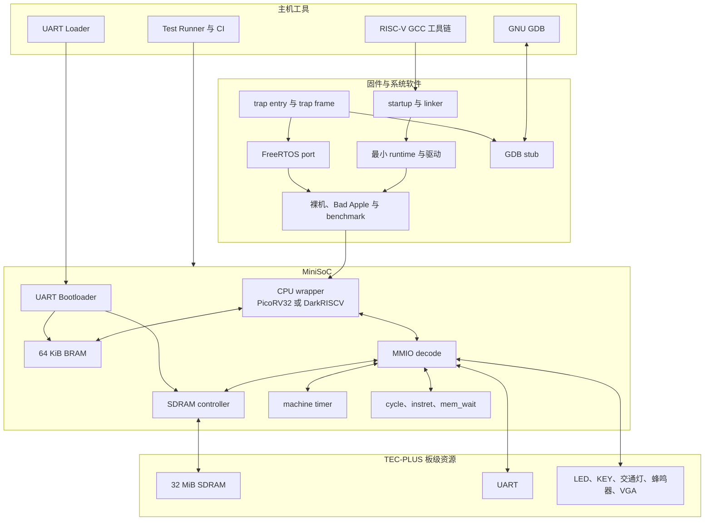
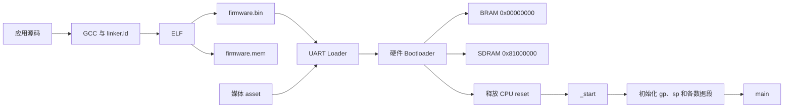
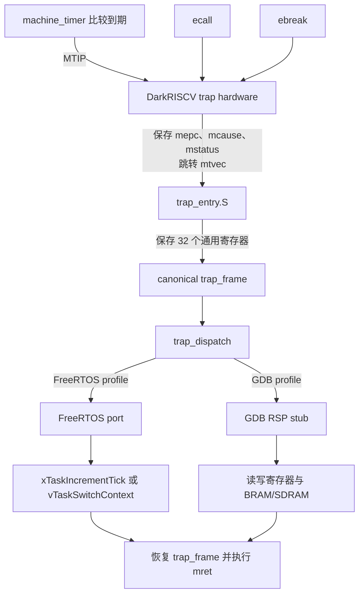

# 面向 TEC-PLUS 资源约束平台的可验证 RISC-V SoC 设计与实现

## 1 实验环境与系统概况

### 1.1 课题定位

我们选择了课程题目 B“基于 FPGA 开发板的处理器设计”，在 TEC-PLUS 开发板上实现一套 RISC-V 小型计算机系统。项目最初从 LED、UART 和 CPU 的基本验证开始，随后逐步加入 SDRAM、Bootloader、machine trap 和 FreeRTOS。最终系统能够运行 Bad Apple 多任务应用，也能够通过 GDB 查看和修改处理器状态。我们还为 DarkRISCV 增加了 DOT4 指令，用固定 workload 测量加速效果和 FPGA 资源开销。

项目保留了两条处理器路径。PicoRV32 结构较小，适合作为 RV32I 多周期基线；DarkRISCV 采用三阶段流水线，也更适合继续加入 machine trap 和自定义指令。我们为两颗核心编写 adapter，再用统一 wrapper 接入同一套存储器、MMIO 地址和固件接口。这样可以让它们运行相同程序，直接比较执行周期和 CPI。

### 1.2 硬件平台

| 项目 | 配置 |
| --- | --- |
| 开发平台 | TEC-PLUS 计算机硬件综合实验系统 |
| FPGA | Xilinx Spartan-6 XC6SLX9-2FTG256 |
| 输入时钟 | 50 MHz |
| 片上存储 | 64 KiB BRAM |
| 外部存储 | 32 MiB SDRAM，数据访问区 |
| 主要外设 | UART、LED、按键、交通灯、蜂鸣器、VGA |
| 硬件开发工具 | Xilinx ISE 14.7 |
| 硬件描述语言 | Verilog-2001 |

XC6SLX9 的资源对设计产生了直接影响。最终 DOT4 配置使用了全部 32 个 RAMB16BWER，Slice 利用率达到 92%。不能只根据功能选择方案，还要查看综合后的资源类型和数量。例如，BRAM 的 RTL 写法会影响 ISE 能否正确推断块存储器，VGA 显示方式也必须根据 LUT 和 BRAM 余量调整。

### 1.3 软件与验证环境

固件使用 `riscv64-unknown-elf-gcc` 交叉编译，目标 ABI 为 `ilp32`。由于程序直接运行在自研 SoC 上，不能依赖 Linux 等宿主环境提供的 C runtime。因此我们准备了自己的启动代码、链接脚本、MMIO 驱动和最小运行库。构建脚本再根据应用目录选择裸机、IRQ 或 FreeRTOS profile，GDB 则作为裸机程序的一种调试构建方式。

本地验证主要使用 Icarus Verilog、Make、Python 和统一测试编排器。GitHub Actions 在 push 和 pull request 时执行快速回归，耗时较长的完整回归由手动工作流或本地命令运行。硬件实现仍由 ISE 完成，包括综合、Map、Place and Route、时序分析和 bitstream 生成。bitstream 中保留 UART Bootloader 后，修改普通固件只需重新编译和串口下载，不需要再次运行完整 ISE 流程。

### 1.4 系统完成情况

经过仿真和上板调试，系统已经打通以下路径：

1. PicoRV32 和 DarkRISCV 均可在同一 MiniSoC 中从 BRAM 取指并运行 RV32I 程序。
2. CPU 可以通过统一地址空间访问 BRAM、32 MiB SDRAM 和 MMIO 外设。
3. UART Bootloader 可以在复位后加载 BRAM 固件和 SDRAM 资源，再释放 CPU。
4. DarkRISCV 支持 machine timer trap，FreeRTOS port 使用该机制完成 tick 和任务切换。
5. Bad Apple 应用使用五个任务驱动 VGA、蜂鸣器、LED、交通灯和按键。
6. cooperative GDB stub 可以通过 UART 读取和修改寄存器、BRAM 与 SDRAM，并从预埋断点继续运行。
7. DarkRISCV 实现 `dot4.s8` custom-0 指令，在固定测试中获得约 26.95 倍的 cycle speedup。

## 2 需求分析与设计目标

### 2.1 课程要求映射

课程将题目 B 分为基础、进阶和拓展三个层次。我们先把每一层要求转换为能够检查的系统行为，再确定对应模块和验证方法。

| 层次 | 课程要求 | 本项目实现 |
| --- | --- | --- |
| 基础 | 支持算术、逻辑、访存和跳转指令，运行测试程序 | PicoRV32/DarkRISCV 双核路径、BRAM 启动、裸机 firmware、官方 RV32I 回归 |
| 进阶 | 集成内存和 I/O，构建完整系统 | 64 KiB BRAM、32 MiB data-only SDRAM、UART、GPIO、VGA、蜂鸣器、交通灯和 timer MMIO |
| 进阶 | 分析性能瓶颈，引入流水线并量化 CPI 和吞吐量 | 在同一 SoC 中比较多周期 PicoRV32 与三阶段流水线 DarkRISCV，记录 cycles、instret、mem_wait 和 CPI |
| 拓展 | 自定义 ISA 或面向矩阵计算的加速指令 | `dot4.s8 rd, rs1, rs2` packed signed INT8 点积指令 |
| 工程要求 | 功能仿真、硬件调试和系统测试 | 模块 testbench、SoC 回归、官方 `riscv-tests`、CI、ISE 时序分析和板级验证 |

项目参考了 PicoRV32、DarkRISCV、FreeRTOS Kernel 和官方 `riscv-tests`。这些项目提供 CPU 核、RTOS kernel 和标准测试，但不能直接组成适配 TEC-PLUS 的系统。我们的工作包括确定 memory map 和模块接口，编写 adapter、SoC、外设、启动代码和 FreeRTOS port，再根据 XC6SLX9 的资源和板级连接完成调整与验证。第四章会分别说明这些工作。

### 2.2 功能目标

项目首先要让程序稳定运行。CPU 从 `0x00000000` 取指，`startup.S` 建立 C 程序需要的初始环境，应用再通过统一驱动访问外设。仿真和上板使用相同的 firmware 源码和 memory map，避免维护两套行为不同的程序。

在程序能够运行后，我们继续加入存储层次。BRAM 保存可执行代码、普通静态数据和栈，SDRAM 保存显式放置的数据段、heap 和媒体资源。当前系统只从 BRAM 取指，这让第一版 SDRAM 可以集中处理数据访问，不必同时解决外部存储启动和取指仲裁。

Bad Apple 和 GDB 对处理器提出了新的要求。前者需要稳定的 timer IRQ 和任务切换，后者需要在 breakpoint exception 发生后保存并读取处理器状态。因此，DarkRISCV 路径还要提供 machine timer、CSR、trap frame 和 `mret` 返回流程。

最后，需要回答“运行得怎么样”。cycle、instret 和 mem_wait 计数器记录固定 workload 的执行情况，ISE 报告记录资源和时序，这两类数据分别说明软件可见性能和 FPGA 实现代价。

### 2.3 约束与能力边界

为了让功能范围和验证范围保持一致，我们确定了以下边界：

- BRAM 是当前唯一可执行存储区，SDRAM 只承载数据、heap 和外部资源。
- SDRAM controller 采用 closed-page、单 outstanding 请求，没有 Cache、burst 或 DMA。
- PicoRV32 作为 RV32I 和性能基线保留；machine trap、FreeRTOS、GDB 和 DOT4 使用 DarkRISCV profile。
- GDB 使用 cooperative breakpoint，需要应用中预埋 `ebreak`，不支持硬件断点、single-step 和运行中异步暂停。
- `dot4.s8` 是一条精确定义的 custom-0 指令，不代表完整 Vector 或 SIMD 扩展。

### 2.4 可观测与基础设施先行

项目最先完成的是 Probe 0 和 Probe 1。它们的功能很简单，但先确认了时钟、复位、LED、按键、UCF 和 UART 链路。后续加入 SDRAM、交通灯、蜂鸣器和 VGA 时，我们继续为高风险模块准备独立 probe，每个 probe 只包含完成一次判断所需的模块和约束，出现问题时可以先检查板级连接，再检查完整 SoC。

系统中保留了多种观测方式，如 UART 输出结构化文本，LED 显示简单状态码，`test_exit` 告诉 testbench 程序是否正常结束，cycle、instret 和 mem_wait 记录性能，VCD 则保存握手与状态机波形。GDB 完成后，我们还可以直接查看运行时寄存器和内存。某一种输出缺失时，其他证据可以帮助判断 CPU、总线或外设究竟停在哪一步。

测试基础设施也在开发早期进入仓库。catalog 统一登记 case 和 suite，runner 负责依赖检查、日志和失败汇总，CI 重复执行构建与仿真。ISE 导出脚本则固定每个目标使用的 top、源码、UCF 和参数。新模块先跑单独测试，再进入子系统和完整 SoC，最后到开发板上检查真实器件行为。

这套流程没有消除调试工作，但它缩小了每次排查的范围。UART 重复写通过 VCD 定位，SDRAM refresh 饥饿由压力 case 发现，Bootloader 长包超时也能在扩大测试数据后稳定复现。相关过程见第五章。

## 3 系统概要设计与总体结构

### 3.1 分层架构

从开发和运行过程来看，系统可以分为主机工具、固件与系统软件、SoC 集成和板级硬件四层。



两颗 CPU 的原生接口不同，不能直接接到同一套 SoC。adapter 先把接口转换为 `ifetch_*` 和 `mem_*`，wrapper 再根据参数选择核心。取指请求只访问双口 BRAM，数据请求按地址分流到 BRAM、SDRAM 或 MMIO。这样既保留了 DarkRISCV 的独立取指和数据通路，也让 PicoRV32 使用相同的 SoC 外部接口。

### 3.2 地址空间与数据流

| 地址范围或地址 | 用途 |
| --- | --- |
| `0x00000000` 至 `0x0000FFFF` | 64 KiB BRAM，代码、普通数据、栈和启动镜像 |
| `0x80000000` 至 `0x81FFFFFF` | 32 MiB SDRAM，数据段、heap 和媒体资源 |
| `0x81000000` | Bad Apple 外部 asset 默认装载地址 |
| `0x10000000` 起的 MMIO 区 | GPIO、UART、计数器、`test_exit`、交通灯、蜂鸣器、VGA 和 timer，精确地址见 `docs/MEMORY_MAP.md` |

BRAM 容量只有 64 KiB，因此代码和大块媒体数据需要分开处理。固件 ELF 中的 `.text`、`.data`、`.bss` 和栈位于 BRAM；显式标注的 `.sdram_data`、`.sdram_bss` 和 heap 位于 SDRAM。Bad Apple 媒体资源不进入 BRAM 镜像，而是由 Bootloader 使用 `LOAD_IMAGE` 命令写到 SDRAM 的约定地址。

### 3.3 启动与装载流程



仿真使用 `firmware.mem` 初始化 BRAM，上板使用固定 bitstream 中的 Bootloader 接收 `firmware.bin`。两个文件来自同一次构建，因此最终执行的是同一份链接结果。Bootloader 本身是 FPGA 中的状态机，不占用 BRAM 代码空间。它在接收和 CRC 校验完成前保持 CPU reset，发送 ACK 后再把 BRAM、SDRAM 和 UART 交给 CPU。

### 3.4 trap、FreeRTOS 与 GDB

FreeRTOS 和 GDB 看起来是两类应用，但它们都需要在程序执行被打断时保存处理器状态。项目因此先为 DarkRISCV 建立 machine trap 路径，再分别接入任务调度和调试协议。



在 FreeRTOS profile 中，timer IRQ 产生系统 tick，machine `ecall` 负责主动 yield。在 GDB profile 中，`ebreak` 让程序进入 stub，随后通过 UART 与主机 GDB 交换 RSP packet。两种 profile 共用 `trap_entry.S` 和 `trap_frame`，当前分别构建和运行。

### 3.5 三个核心 demo

我们准备了三个覆盖范围不同的 demo：

Bad Apple 用来检查系统能否持续运行多任务应用。Bootloader 将固件写入 BRAM、将约 1 MiB 媒体资源写入 SDRAM，FreeRTOS 使用五个优先级不同的任务管理 VGA、蜂鸣器、LED、交通灯和按键。一次完整播放会经过启动、外部存储、timer IRQ、任务调度和多种 MMIO 外设。

GDB demo 用来展示系统把运行状态交给外部调试器。程序在 `main()` 前和用户指定位置进入 `ebreak`，stub 将 trap frame 转换为 GDB 寄存器格式，并把可访问内存限制在 BRAM 和 SDRAM。演示时先修改 BRAM 变量和 SDRAM 数组，再继续运行。程序计算结果和 LED 状态会随修改变化，从而证明 GDB 操作确实影响了 CPU 后续执行。

DOT4 benchmark 用来检查自定义指令的正确性和收益。scalar 和 custom 路径处理相同的 signed INT8 数据，先比较 checksum，再记录 cycles、instret 和 mem_wait。ISE 报告继续检查 DSP 推断、资源占用和 50 MHz 时序，防止只报告软件层的加速倍率。

### 3.6 验证结构

我们设计了不同层级的测试结构：

| 层次 | 目标 | 代表证据 |
| --- | --- | --- |
| 模块级 | 检查单个 RTL 或软件组件 | UART、BRAM、SDRAM controller、DOT4、GDB packet test |
| 子系统级 | 检查接口和状态机组合 | Bootloader、CPU wrapper、machine timer、FreeRTOS frame contract |
| SoC 级 | 运行真实 CPU 和 firmware | 双核 smoke、SDRAM、timer IRQ、FreeRTOS、Bad Apple testbench |
| 标准与回归 | 检查指令语义和跨模块回归 | 官方 RV32I、DarkRISCV rv32mi、CI fast/full suite |
| 板级 | 检查管脚、资源、时序和真实器件 | Probe 0 至 5、ISE 报告、UART 日志和现场现象 |

SoC testbench 尽量使用 `test_exit` 判定结果，UART、LED 和 VCD 负责解释失败位置。板级 probe 则用简单、可重复的现象检查物理链路。probe 通过后，同一模块再接入完整 MiniSoC，避免为了测试维护另一份实现。

## 4 各功能模块的详细设计与实现

### 4.1 GCC 工具链与 firmware profile

项目中的应用有裸机、IRQ 和 FreeRTOS 三种运行方式。如果每个程序单独维护编译命令，启动代码和依赖很容易混在一起。我们因此把 `scripts/build_firmware.sh` 作为统一入口，再根据应用类型选择源码。

脚本使用 `-march=rv32i` 或 `rv32i_zicsr`、`-mabi=ilp32`、`-ffreestanding`、`-nostdlib` 和 `-nostartfiles` 编译应用。需要 CSR 指令的 IRQ、FreeRTOS 和 GDB profile 使用 `rv32i_zicsr`。考虑到实验环境中的 GCC 版本不同，脚本会先检查工具链是否接受 `Zicsr` 名称，旧版本则回退到 `rv32i`。

构建系统按应用类型选择源码：

| profile | 加入的主要内容 | 适用范围 |
| --- | --- | --- |
| baremetal | startup、驱动、最小 runtime | 轮询程序、benchmark、板级自检 |
| irq | baremetal + trap entry + machine timer | DarkRISCV machine timer 程序 |
| freertos | trap runtime + FreeRTOS Kernel + TecPlusRV port + heap | DarkRISCV 多任务应用 |
| gdb debug | baremetal + debug symbol + GDB packet/stub/bootstrap | cooperative 裸机调试 |

GDB 没有单独的应用目录，它是 baremetal 的一种调试构建方式。链接参数 `--wrap=main` 把入口替换为 `__wrap_main()`，在用户 `main()` 前安装 trap 并进入第一次断点。当前 stub 还不能理解 FreeRTOS task，因此构建脚本会拒绝给 FreeRTOS 应用叠加 GDB profile。

RV32I 基础指令集中没有整数除法，十进制打印和 CPI 计算仍会产生除法、取模操作，所以链接阶段加入 `-lgcc` 提供软件例程。脚本还会统计 BRAM section 大小，超过 64 KiB 时停止构建，超过 48 KiB 时给出警告。一次构建最终得到 `.elf`、`.bin`、`.mem` 和 `.lst`，分别供符号调试、Bootloader、Verilog 初始化和反汇编检查使用。

### 4.2 链接布局、启动代码和最小运行库

GCC 可以生成机器码，但程序还需要知道代码、数据、栈和 heap 分别放在哪里。`firmware/linker.ld` 为此定义 BRAM 和 SDRAM 两个 memory region，并用 `ENTRY(_start)` 将复位入口放在 BRAM 起点。CPU 开始执行后，`startup.S` 先初始化栈指针和 `gp`，再搬运 `.data`、清零 `.bss`，随后处理 SDRAM 中的两个数据段，最后调用 `main()`。

在 `-nostdlib` 构建下，常用库函数也需要由项目提供。当前运行库只实现应用和测试实际使用的部分。

`rt_string.c` 提供 `memcpy`、`memset` 和 `memmove`。SDRAM controller 对 CPU 暴露 32-bit 请求，逐字节处理会把一个 word 拆成四笔总线事务。`memcpy` 和 `memset` 先处理未对齐字节，中间区域使用 32-bit fast path，末尾再处理不足一个 word 的数据。`memmove` 根据源和目的区间选择正向或反向复制，保证重叠区域语义正确。

`rt_print.c` 复用 UART 驱动实现字符串、十六进制和十进制输出。这些接口已经能够输出启动诊断、性能结果和板级验收信息，因此没有继续引入完整 `printf`。

`rt_alloc.c` 使用 linker 导出的 `_heap_start` 和 `_heap_end` 实现 bump allocator。分配函数支持对齐、容量检查和 reset 后重新初始化。普通裸机 heap 位于 SDRAM。FreeRTOS 使用 `heap_5`，由 `freertos_heap.c` 将 SDRAM 区间提供给 kernel。

### 4.3 双 CPU adapter 与统一 wrapper

引入第二颗 CPU 后，首先遇到的问题是接口不同。PicoRV32 使用统一 memory handshake，DarkRISCV 则分开提供 instruction bus 和 data bus。我们没有让这些差异进入整个 SoC，而是为两颗核心分别实现 adapter，再由 `tecplus_cpu_wrapper` 输出统一的 `ifetch_*`、`mem_*`、cycle 和 instret 接口。

DarkRISCV 的 data request 会保持到 ACK。MiniSoC 记录已经完成的请求，在核心仍保持相同请求时返回原响应，但不重复触发 UART、GPIO 等 MMIO 副作用。该处理保留核心原有 handshake 语义，也保证一次 store 只产生一次外设动作。

wrapper 还把核心内部的 cycle 和 instret 计数器导出到统一 MMIO 地址。benchmark 不需要根据 CPU 类型读取不同 CSR，两颗核心可以运行完全相同的测量代码。

### 4.4 BRAM 与 SDRAM

BRAM 同时承担取指和普通数据访问，因此使用双口结构。取指口只读，数据口支持字节写使能。RTL 加入 `ram_style="block"` 属性，避免 ISE 将 64 KiB 存储器展开为大量 LUT RAM。Bootloader 活跃时暂时接管数据端口，此时 CPU 保持 reset；加载完成后，端口再交回 CPU。

外部 SDRAM 芯片的数据宽度为 16 bit，而 CPU 发出 32-bit 请求。controller 会把一笔 CPU 请求转换为两次物理访问，并负责初始化、ACTIVATE、READ/WRITE、PRECHARGE 和 AUTO REFRESH。第一版采用 closed-page 策略，每笔访问结束后关闭 row。这样状态机更容易验证，但无法利用 burst 和 row hit，所以访存密集型 benchmark 会出现较高 `mem_wait`。

MiniSoC 将 `0x80000000` 至 `0x81FFFFFF` 分配给 SDRAM。控制器支持 byte、halfword 和 word 写掩码，双核 SoC 回归分别验证 PicoRV32 和 DarkRISCV 的数据访问。

### 4.5 UART Bootloader

如果每次修改 C 程序都重新综合 bitstream，固件调试会耗费大量时间。UART Bootloader 让硬件配置和应用程序分开更新。reset 后，它接管 UART、BRAM 和 SDRAM 请求，并保持 CPU reset。硬件发送 READY 后，host 再发送 magic、version、command、长度、payload 和 CRC32。合法 packet 返回 ACK，错误 packet 返回带错误码的 NACK。

`LOAD_AND_RUN` 只写 BRAM。`LOAD_IMAGE` 在同一 packet 中携带 BRAM 固件和 SDRAM asset，两个区域写入并通过整体 CRC 后才释放 CPU。Bad Apple 使用该命令将媒体资源写到 `0x81000000`。当 asset 已经存在时，host 可以只更新 BRAM，缩短固件调试时间。

Bootloader 对长度、CRC、UART framing、overrun、超时和 SDRAM 响应进行检查。失败时 CPU 保持 reset，host 可以重新发送完整 packet。协议采用整包 CRC 和整包重传，没有实现逐块 ACK 和断点续传。

### 4.6 MMIO 外设与观测接口

CPU 使用普通 load/store 指令访问外设。`tinybus_decode` 根据地址生成 select 信号，MiniSoC 在请求完成时产生单周期写使能。当前地址空间中的主要外设包括：

- GPIO 读取按键并控制 LED。
- UART TX/RX 提供程序输出、输入、Bootloader 和 GDB 通信。
- 交通灯外设输出 12 位灯态。
- 蜂鸣器外设通过 enable 和 half-period 控制方波频率。
- VGA bitmap 外设保存 64×48 的 1-bit 画面并扩展到 640×480 timing。
- machine timer 提供 64-bit `mtime`、`mtimecmp` 和 timer IRQ。
- cycle、instret 和 mem_wait 寄存器提供性能数据。
- `test_exit` 为仿真提供结束码，不依赖 UART 文本解析。

VGA text 原型保留为独立 probe，最终 MiniSoC 默认使用 bitmap。该选择来自 ISE 资源报告，详见第五章。

### 4.7 machine trap 与 canonical trap frame

FreeRTOS 和 GDB 都要求程序能够在被打断后恢复原来的寄存器状态。我们先定义一套公共 trap frame，再让不同 profile 只处理各自的事件。

初始化时，`trap_init()` 将 `trap_entry` 地址写入 `mtvec`。发生 timer IRQ、`ecall`、`ebreak` 或其他异常后，DarkRISCV 保存 `mepc`、`mcause` 和 `mstatus`，再跳转到 `mtvec`。

`trap_entry.S` 将 32 个通用寄存器和 machine CSR 保存到统一 `trap_frame`，调用 `trap_dispatch(frame)`，然后按返回指针恢复 frame 并执行 `mret`。默认 dispatcher 直接返回原 frame。IRQ 应用、FreeRTOS port 和 GDB stub通过强符号覆盖它，因此各 profile 使用相同的汇编保存与恢复代码。

machine timer 在 `mtime >= mtimecmp` 时拉高 IRQ。handler 必须把 `mtimecmp` 推进到下一次 tick，否则 timer IRQ 保持有效，CPU 会再次进入 trap。

### 4.8 FreeRTOS port 与 Bad Apple

FreeRTOS Kernel 已经提供任务、队列、链表、timer 和 event group，但它不知道 DarkRISCV 怎样进入和退出 trap。项目编写的 port 补上这部分工作，包括构造初始 trap frame、启动第一个任务、把 timer IRQ 转换为 tick、把 `ecall` 转换为 yield，以及在 trap 返回时恢复选中任务的上下文。

`pxPortInitialiseStack()` 在任务栈顶构造与 trap entry 相同格式的 frame，写入任务入口、参数、栈指针、`gp`、`tp` 和初始 `mstatus`。scheduler 启动时先配置 `mtimecmp` 和 MTIE，再从当前 TCB 保存的 frame 执行第一次恢复。这样首次进入任务和中断后的任务恢复使用同一条路径。

Bad Apple 使用五个静态任务：

| 任务 | 职责 | 主要同步方式 |
| --- | --- | --- |
| playback | 解析帧和音符事件，更新 VGA | queue、notification、delay |
| audio | 设置蜂鸣器频率 | audio queue |
| LED | 根据节拍闪烁 | task notification |
| traffic | 周期更新交通灯 | `vTaskDelay` |
| button | 轮询按键并更新暂停状态 | 10 ms delay、critical section |

host 从原视频和 MIDI 生成媒体 asset，再通过 Bootloader 写入 SDRAM。playback task 从 `0x81000000` 读取资源。五个任务分别管理自己的外设，queue 和 notification 传递播放事件，短 critical section 只保护暂停等共享状态。这种分工让故障更容易对应到具体任务和外设。

### 4.9 cooperative GDB stub

完成 trap frame 后，我们希望能直接从成熟的 GDB 查看它，而不是再设计一套专用调试界面。GDB debug build 通过 `--wrap=main` 在应用执行前安装 trap 并执行第一次 breakpoint。用户代码中的 `DEBUG_BREAK()` 在 debug build 中生成 `ebreak`，普通 build 中则为空操作。

GDB stub 实现最小 Remote Serial Protocol。它支持 stop reply、读取和写入全部通用寄存器及 PC、读取和写入 BRAM/SDRAM、查询基础 target 信息和 continue。寄存器来自当前 trap frame，PC 对应 `mepc`。内存访问先检查范围，防止 GDB 读取具有副作用的 MMIO。

GDB 会话期间 UART 由 RSP 独占，应用把需要观察的状态保存在 `volatile` 变量中。当前实现支持寄存器、内存和继续执行，不支持动态断点、single-step、异步 Ctrl-C 和 FreeRTOS thread view。

### 4.10 `dot4.s8` 自定义指令

在拓展功能中，我们考虑过 MMIO accelerator、乘除法、浮点和完整 SIMD。考虑到开发时间、资源和可验证范围，最终选择一条 packed signed INT8 点积指令。`dot4.s8 rd, rs1, rs2` 使用 RISC-V custom-0 opcode，两个源寄存器各包含四个 signed INT8，硬件计算四组乘积之和，再将 signed 32-bit 结果写回 `rd`：

```text
rd = s8(rs1[7:0])   × s8(rs2[7:0])
   + s8(rs1[15:8])  × s8(rs2[15:8])
   + s8(rs1[23:16]) × s8(rs2[23:16])
   + s8(rs1[31:24]) × s8(rs2[31:24])
```

RTL 通过请求 tag 绑定指令和结果。只有当前请求 tag 与已计算结果 tag 相同时才拉高 ACK，防止连续两条 custom 指令复用上一条指令的 ACK。`rd=x0` 保持零寄存器语义，其他 custom-0 编码进入 illegal-instruction trap。

firmware 使用 `dot4_s8()` 包装函数隔离自定义编码。benchmark 同时运行 RV32I scalar 参考实现和 custom 实现，比较 checksum 后再输出性能数据。

### 4.11 自动化验证与协作记录

项目后期的测试入口逐渐增多，只靠 Makefile target 很难判断哪些测试属于同一组。我们把 case 和 suite 集中登记在 `scripts/test_catalog.json` 中，由 `test_runner.py` 解析依赖、展开 suite、执行测试并保存日志。CI 在普通 push 和 pull request 上执行快速集合，手动触发时再运行完整集合。

官方 `riscv-tests` 保持上游 case 不变，平台差异放在 `tecplus_p` 和 `tecplus_m` target environment。RV32I case 同时运行两颗 CPU，machine CSR、trap 和 misaligned case 只在 DarkRISCV 上运行。

GitHub issue 用于定义任务边界、依赖和验收命令，pull request 用于集中审阅双核 wrapper、machine trap 和 DOT4 等跨模块修改。提交记录保留了模块实现、测试、板级结果和文档的演进过程。

## 5 设计与调试中的主要问题

### 5.1 顶层选择和 BRAM 推断导致资源超限

第一次在 ISE 中综合 PicoRV32 时，报告中的 bonded IOB 达到 317/186，远远超过器件容量。检查顶层设置后发现，工程误把 `picorv32_axi` 设成了 top，它的内部总线端口因此都被当成 FPGA 外部引脚。我们随后增加 `tecplus_minisoc_top`，顶层只保留开发板实际使用的时钟、复位、串口、SDRAM 和外设引脚。

修正 top 后，综合仍然无法通过。这次是 64 KiB RAM 被推断成 LUT memory，Slice LUT 使用量达到 10166/5720。我们在 `bram.v` 中增加 block RAM 推断属性，并把存储写法调整为 ISE 能识别的形式，综合器才改用 RAMB16BWER。由此我们也确定了一条检查原则：存储 RTL 能通过仿真还不够，还要查看它最终被映射成了什么资源。

### 5.2 UART 丢字与重复写

早期 UART probe 本来应该输出完整字符串，实际却只得到 `HloTclsV`，几乎每隔一个字符就丢失一次。波形显示，发送端在 `uart_tx` 真正接收字节之前就推进了消息索引。我们把索引更新条件改为 `valid && ready`，让它只在握手成立后前进，丢字现象随即消失。

DarkRISCV 接入 MiniSoC 后，UART 又出现了相反的问题：板上每个字符都会输出两次。VCD 中可以看到，一条 store 产生了两次 `uart_fire`。继续对照两侧接口后发现，DarkRISCV 会保持 data request 直到收到 ACK，而 MiniSoC 在第一次响应后立即撤销内部 pending，于是把仍保持的同一请求当成了下一笔事务。

我们最终让 MiniSoC 记录上一笔已完成请求。遇到 replay 时，SoC 返回相同结果，但不再执行第二次 MMIO 写。这样既保留了 DarkRISCV 的原生总线语义，也在真正产生 UART 副作用的一侧解决了重复写。

### 5.3 性能计数器有读数但口径不一致

双核刚接入时，MiniSoC 在 SoC 顶层估算 cycle 和 instret。相同程序运行在两颗 CPU 上，第一次得到的 instret 分别是 156901 和 202448。这个差异既可能来自核心，也可能来自顶层对请求、等待和指令完成的判断不同，因此不能直接用来计算 CPI。

我们保留 firmware 可见的 MMIO 地址，但把数据来源改成 CPU core 自己的 backing counter。PicoRV32 的 cycle、instret 和 DarkRISCV 的 `CSRCLK`、`CSRINS` 先由各自 adapter 导出，再经过统一 wrapper 接到 MiniSoC。专项 regression 会比较 MMIO 读数和 core 输出，防止以后又退回顶层估算。修改后，相同 workload 的两颗 CPU 得到相同的 instret 读数，cycle 差异才可以用于内部对照。

DarkRISCV 的 `CSRINS` 在核心未等待且流水线没有 flush 时递增，仍是上游实现采用的近似统计，不是严格 retire pulse。报告因此把它作为固定 workload 下的比较口径，不把数值解释为标准性能监控单元给出的精确退休指令数。这个过程也说明，可观测接口建立之后，还要检查它测量的对象是否一致。

### 5.4 SDRAM refresh 在连续请求下饥饿

SDRAM controller 的短时仿真一直能够完成初始化、写入和读回，但板级压力 case 在连续 `req_valid` 时发现 refresh 计数不再增长。回看初版测试后，我们发现测试只在停止请求后检查 refresh。旧实现会在压力结束后补做一次 refresh，所以短测试看起来仍然正确。

真正的问题出在 IDLE 状态对普通请求和延期 refresh 的仲裁上。我们保留了 controller 原有的 refresh 延期语义，同时限制连续请求最多能把 refresh 推迟多久。测试也改成在压力窗口内检查 refresh 是否发生。这样旧实现会稳定失败，修复后的实现则能稳定通过。上板后，probe 通过 UART 输出 PASS，LED 显示约定的 `1000`。

### 5.5 从 SDRAM 段布局到 Bootloader 双区装载

为 Bad Apple 准备媒体资源时，我们最初尝试把大数组放进 `.sdram_data`。链接结果显示，对象的运行地址 VMA 已经位于 SDRAM，但加载地址 LMA 仍在 BRAM。复位后，`startup.S` 会把这份初值从 BRAM 搬到 SDRAM，因此 firmware 镜像仍然受到 64 KiB BRAM 的限制。这是有初值数据段的正常语义，单纯修改运行地址不能解决接近 1 MiB 的 asset 装载问题。

最终方案将媒体 asset 从普通 firmware 镜像中分离。Bootloader 的 `LOAD_IMAGE` 命令在同一个 packet 中携带 BRAM firmware、SDRAM 目标地址和 SDRAM asset。两块内容均接收完成且整包 CRC 通过后，Bootloader 才释放 CPU。普通的小型 `.sdram_data` 仍由 linker 和 `startup.S` 管理，Bad Apple 资源则由 host 直接写到 `0x81000000`。这样既保留了常规 C 数据段语义，也让大型外部资源不再占用 BRAM 镜像。

Bootloader 最初的 SDRAM 测试只写两个 word，整个传输不会跨越 refresh 周期。后来 asset 变大，请求偶尔会停在 `valid=1、ready=0`，host 端最终超时。我们把测试数据扩大到 68 个 word，才稳定复现了这个现象。

对照波形后可以看到，SDRAM controller 使用 ready-first 请求语义，Bootloader 却在 ready 拉高前持续保持 valid。双方对一次请求何时成立的理解并不一致。修复后，Bootloader 只在 controller ready 时提交一次请求，与 CPU 的 SDRAM 路径使用同一套契约。68-word 长包也保留为回归测试，用来覆盖短 smoke 不会经过的 refresh 边界。

### 5.6 VGA 方案受 LUT 和 BRAM 约束

我们最初计划用字符和 tile 组合显示画面，但加入 MiniSoC 后，ISE 报告 LUT 已超过器件容量。字符模式需要字模查找、tile 存储和组合寻址，在当前 SoC 配置中没有足够资源。

因此，最终画面改用 64×48 的 1-bit bitmap，每个逻辑像素在 640×480 输出中放大为 10×10 像素。framebuffer 也改写成综合器容易识别的存储形式，避免二维数组被展开成大量寄存器和 LUT。字符模式仍保留为独立 probe，用于验证 VGA timing 和字模，但不进入 MiniSoC 的默认配置。

### 5.7 FreeRTOS 低优先级任务得不到运行时间

Bad Apple 早期版本里，playback task 已经主动调用 `taskYIELD()`，LED 和交通灯等低优先级任务却还是不能稳定运行。问题不在于有没有 yield，而在于 FreeRTOS 的 yield 只会让同优先级的 ready task 获得机会。高优先级 playback 仍然可以立即重新占用 CPU。

我们把 playback 每轮的让出方式改成 `vTaskDelay(1)`，让它真正进入 Blocked 状态，scheduler 才能选择低优先级任务。audio task 使用阻塞 queue，交通灯和按键任务也设置明确周期，避免用忙等持续占用 CPU。

### 5.8 连续 DOT4 请求复用旧 ACK

DOT4 单元的第一版只用 `result_valid` 表示结果可用。单条指令测试都能通过，但相邻两条 custom 指令连续出现时，上一条指令的 ACK 可能还没有撤销，新指令就会直接使用旧结果。

修复后，单元会保存产生结果的 instruction tag。ACK 条件改为 `result_valid && req && tag == result_tag`，tag 变化时先撤销旧 ACK，再计算新结果。专项 testbench 随后加入相邻请求、stall、reset、`rd=x0`、非法编码和 timer IRQ 边界，不再只检查单条指令的算术结果。

### 5.9 AI 与开源参考的审阅方式

项目使用了开源 PicoRV32、DarkRISCV、FreeRTOS Kernel 和官方 `riscv-tests`。我们保留 CPU 核和 RTOS kernel 的上游主体，把平台差异集中放在 adapter、wrapper、port 和 target environment 中。这样升级或排查上游模块时，不需要同时修改 SoC 和应用层。官方测试也没有直接改写，而是通过项目自己的 target environment 接入两颗 CPU。

AI 工具参与了方案讨论、代码草拟、错误分析建议、测试补充和文档整理。FreeRTOS port 开发中，AI 辅助整理了初始 trap frame、timer IRQ 到 tick、`ecall` yield 等实现；`LOAD_IMAGE` 开发中，AI 也补充了 host 客户端。我们随后分别用 trap 专项测试、长 packet、CRC/NACK 和真实上板流程检查这些内容，并对照已有接口决定最终放置位置。VGA text probe 的字模数据也使用了 AI 生成结果，但该方案是否进入最终系统仍由 ISE 资源报告决定。

生成内容不能代替工程判断，SDRAM refresh 的第一次修改虽然让测试通过，却改变了原控制器的延期语义，组员复核后重新设计了仲裁。FreeRTOS 调试中也尝试过增加 task stack、调整 deferred yield 时机等修改，但它们只让失败位置发生变化，没有形成稳定复现和因果证据，因此没有合入主分支。项目对 AI 和开源内容采用相同标准：先明确接口和适用范围，再用代码、波形、仿真或上板结果验证。

## 6 调试总结与效果分析

### 6.1 功能验证结果

项目最终完成了从 CPU 指令到板级应用的分层验证。基础 RV32I 通过官方指令测试和双核 regression；DarkRISCV 还运行了 machine CSR、`ecall`、illegal instruction、breakpoint 和 misaligned trap case。PicoRV32 不支持的 `fence.i` 与扩展边界单独记录，没有计入基础通过集合。

上板时，我们先从 Probe 0 开始确认时钟、复位和最小输出，再逐步加入 UART、SDRAM、交通灯、蜂鸣器和 VGA。每条链路都有独立可见现象后，才进入 MiniSoC 集成。最终，Bootloader 可以重复加载裸机、IRQ 和 FreeRTOS 程序。

三个核心应用分别给出了不同层面的结果。Bad Apple 能联合运行视频、蜂鸣器旋律、节拍 LED、交通灯和按键暂停；GDB 能完成 attach、寄存器读取、BRAM/SDRAM 读写和 continue；DOT4 在真实开发板上输出了相同的 scalar/custom checksum，并通过性能断言。

### 6.2 双核性能对比

PicoRV32 和 DarkRISCV 运行相同 firmware、相同 memory map 和相同 workload。以下为仿真基线中的代表结果。

| workload | Pico CPI | Dark CPI | Dark cycle speedup |
| --- | ---: | ---: | ---: |
| ALU dependency | 6.167 | 2.667 | 2.31 倍 |
| Branch alternating | 5.923 | 3.231 | 1.83 倍 |
| BRAM load/store | 6.300 | 3.201 | 1.97 倍 |
| Mixed | 5.972 | 2.802 | 2.13 倍 |
| Median BRAM | 7.052 | 4.588 | 1.54 倍 |
| Memcpy BRAM | 6.499 | 3.999 | 1.63 倍 |

这些 workload 使用相同 firmware 和输入，在本项目的统计口径下，两颗 CPU 的 instret 读数一致，因此可以比较 cycle 和 CPI。DarkRISCV 的 `CSRINS` 不是严格 retire pulse，相关数值只用于同一测试体系内的相对比较。DarkRISCV 在计算和 BRAM workload 上减少了约 35% 至 57% 的周期。分支 workload 的收益小于 ALU dependency，这与流水线遇到控制转移时需要 flush 的实现相符。

### 6.3 BRAM 与 SDRAM

我们还在真实开发板上比较了同一 workload 放在 BRAM 和 SDRAM 中的差别。结果如下。

| workload | BRAM cycles | SDRAM cycles | SDRAM/BRAM | SDRAM wait 占比 |
| --- | ---: | ---: | ---: | ---: |
| System stencil | 54966 | 125908 | 2.29 倍 | 72.3% |
| Median | 23350 | 51312 | 2.20 倍 | 69.9% |
| Memcpy | 128126 | 261822 | 2.04 倍 | 66.2% |
| Memset | 22654 | 37230 | 1.64 倍 | 53.0% |
| CRC32 | 655428 | 729638 | 1.11 倍 | 13.0% |

System stencil、Median 和 Memcpy 的 SDRAM wait 占比都超过 66%，主要时间花在 closed-page、单 outstanding 控制器的往返等待上。CRC32 有较多位运算，计算本身占主导，换到 SDRAM 后只增加约 11% 周期。

如果继续优化，当前平台更适合先尝试 BRAM 分块、软件 line buffer 和数据复用，减少实际发生的 SDRAM 事务。burst、DMA 或 Cache 需要重新定义控制器契约并补充验证，本轮项目没有实现。

### 6.4 DOT4 性能、资源与时序

DOT4 benchmark 执行 32 个向量、16 轮，共 512 次四元素 signed INT8 点积。scalar 和 custom checksum 均为 `0x00000170`。

| 模式 | cycles | instret | mem_wait | 50 MHz 运行时间 |
| --- | ---: | ---: | ---: | ---: |
| RV32I scalar | 694304 | 242721 | 22548 | 13.886 ms |
| custom DOT4 | 25760 | 6721 | 6164 | 0.515 ms |

custom 路径的 cycle speedup 为 26.95 倍，instret 读数约为 scalar 路径的 1/36.11。虽然 custom CPI 更高，但一条 custom 指令已经完成四次乘法和求和，所以这里更适合比较整个 workload 的总周期和吞吐量。按 50 MHz 计算，custom 路径约为 993.8k dot products/s。

最终含 DOT4 配置的 ISE 结果如下。

| 指标 | 结果 |
| --- | ---: |
| Slice | 1319/1430，92% |
| Slice LUT | 4200/5720，73% |
| Slice Register | 1607/11440，14% |
| RAMB16BWER | 32/32，100% |
| DSP48A1 | 4/16，25% |
| 50 MHz setup slack | 0.650 ns |
| 50 MHz hold slack | 0.343 ns |

四个 DSP48A1 对应 DOT4 中的四路 INT8 乘法。setup 和 hold slack 都为正，满足 20 ns 周期约束。不过 Slice 和 BRAM 已经接近或达到器件上限，若继续加入 framebuffer、Cache 或更宽的向量单元，首先会遇到资源不足。当前没有无 DOT4 配置的同口径报告，也没有本配置的功耗估算，因此这里只给出绝对资源和时序，不估算资源增量或功耗。

### 6.5 项目结果与当前边界

回看整个开发过程，项目从最小的 LED、UART probe 起步，最后打通了 FPGA 板级链路、RISC-V 软件环境和三个系统级应用。CPU、存储、MMIO、Bootloader、runtime 和工具链之间都有明确接口；FreeRTOS 与 GDB 复用同一套 trap frame；Bad Apple、GDB stub 和 DOT4 分别检验了多任务运行、交互调试和自定义指令加速。

主要结果可以概括为：

1. 用 probe 和分层回归把板级风险、接口错误和系统错误分开定位。
2. 在同一 SoC 外壳中保留多周期和流水线两颗核心，获得可复跑的 CPI 对照。
3. 将 32 MiB SDRAM、最小 runtime 和 UART Bootloader 接入真实程序执行流程。
4. 完成 machine trap、FreeRTOS port 和 cooperative GDB stub。
5. 在 XC6SLX9 资源限制内完成 DOT4 指令，并获得板级正确性、性能和时序证据。

当前系统也有清楚的边界。SDRAM 还没有 Cache、burst、DMA 和取指能力；GDB 不支持动态断点和单步；PicoRV32 不运行 machine trap profile；DOT4 只覆盖一条 packed INT8 指令。
